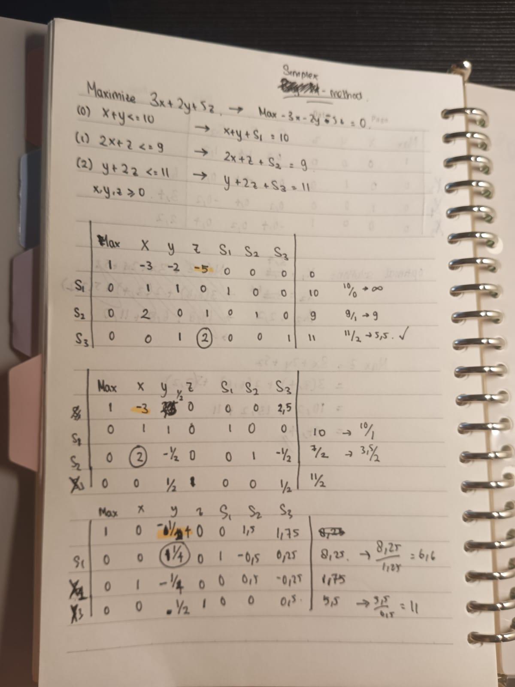
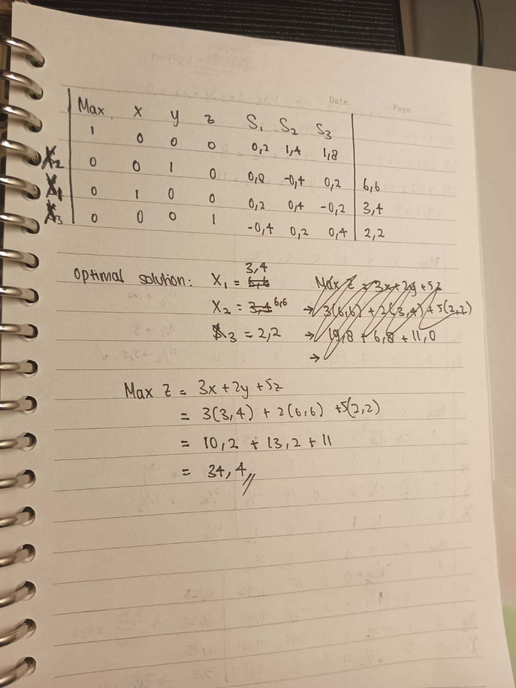

# LINEAR PROGRAMMING
## Simplex Method by Hand
I used Simplex method to see the optimal solution by hand. The result of the optimal solution that I wrote on the paper is the amount of x which is 3.4, y which is 6.6, z which is 2.2 and the maximized amount which is 34.4. From this calculations, the final solution of the code should be the **same** as the result of the simplex method that I wrote on the paper or it should be **more optimal**.    




## Linear Programming with Random   

```
Approximate optimal value: 34.28
Approximate optimal solution (x, y, z): (3.3, 6.19, 2.4)
```   

>From above, we can see that it's not the most optimized solutions eventhough I put the max iterations 500000 times.
## Linear Programming with Brute   

>I wrote another code that that tests one by one of each x,y and z values for +0.1 values because the previous code that I did, haven't had an optimal solution. These are the results:   

```
Approximate optimal value: 34.4
Approximate optimal solution (x, y, z): (3.4, 6.6, 2.2)
```
>The result is the same as the result I did with the simplex method. I tried to improve it using +0.01 values but it takes to long to load so I didnt do it.