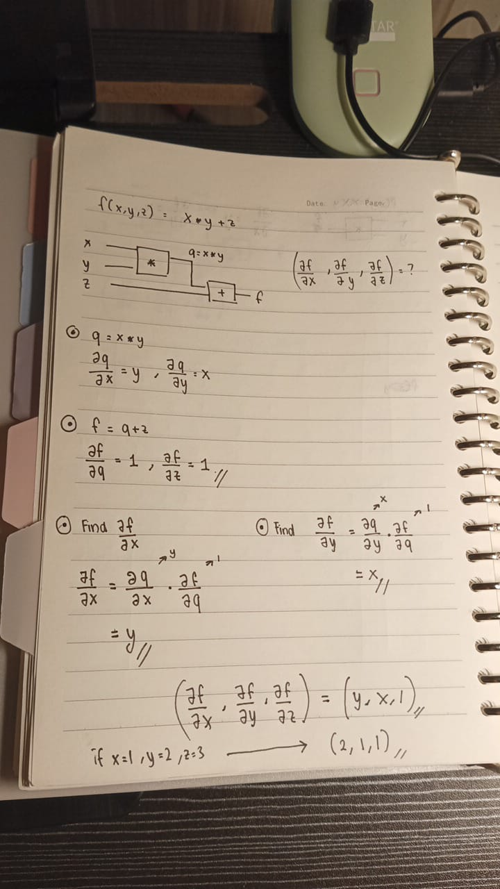
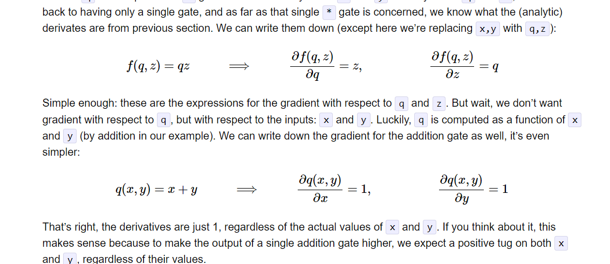
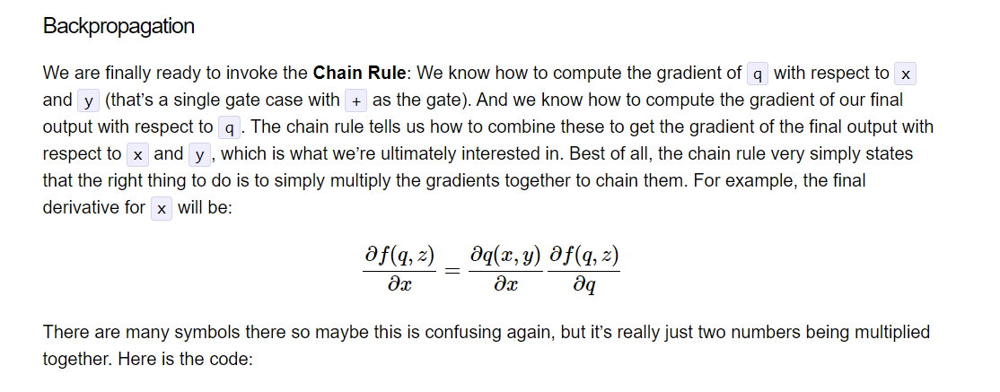

# Neural Networks and Backpropagation
Answer:   
   

>Backpropagation is used to minimize an error or loss between predicted outputs and actual outputs with partial derivatives and chain rule. How I did the assignment is from looking at the notes that karpathy had. These are the parts I saw :

   
   