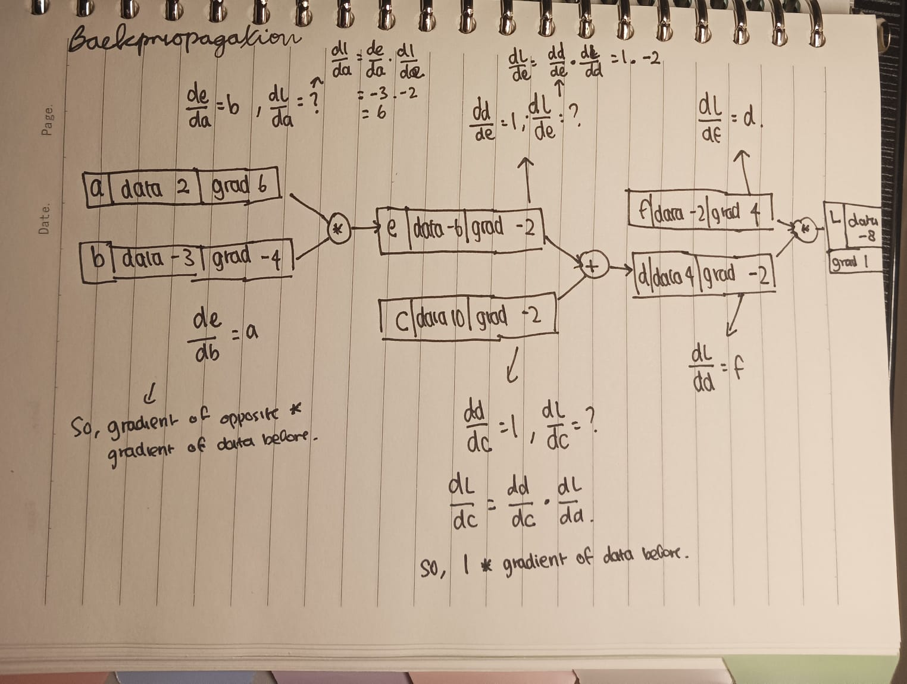

# Building a Micrograd

## Understanding Derivatives   

Derivatives calculates how a function will respond if the input changes. For example the usual formula of a derivative is (f(a+h)-f(a))/h. So, f(a) is the original function. When it becomes f(a+h), it means that thevalue of (a) in a function is added by h. So the result of the function will change. for example f(a) is 20if a is 3 with the function 3*x^2 - 4*x +5. If we add h with the amount of 0.01 to a, it'll change to f(20+001) and the whole function output will different, either increase or decrease. In this case, the result is 2001400 which means it increases in a postive direction. After reaching that point, we want to know how much itchanged, so we minus f(a+h)-f(a) and find out that the changes is 0,01400. Division by h is to normalize itinto 14. 

### Why is Derivatives used in machine learning?
A large derivative means that the function is increasing rapidly (the slope is steep). In machine learning, all is done for optimization. Using derivatives, we will later learn that we will calculate gradient and loss. gradient does functions of multiple variables while derivatives does only one variable. So, gradient is used to represent the direction and rate of steepness in a function. In machine learning, gradient provides the direction and magnitude of the steepest ascent of the loss function. Since we want to minimize the loss, we move in the opposite direction of the gradient. Since, gradient focuses on the steepest ascend while what we want is a descent of losses(decrease losses).

## Understanding Backpropagation
   
Named backpropagation is because we try to find the gradient from the back to the front on by one.   

### TANH
tanh is used in neural networks as an activation function to ensure that the outputs of neurons are within a certain range, specifically between -1 and 1. During backpropagation, this characteristic helps to scale the gradients, which can aid in maintaining stable training. The use of tanh does not directly ensure that the final result of the gradient is within -1 to 1 but it does help in keeping the intermediate values and gradients within this range during the training process.
