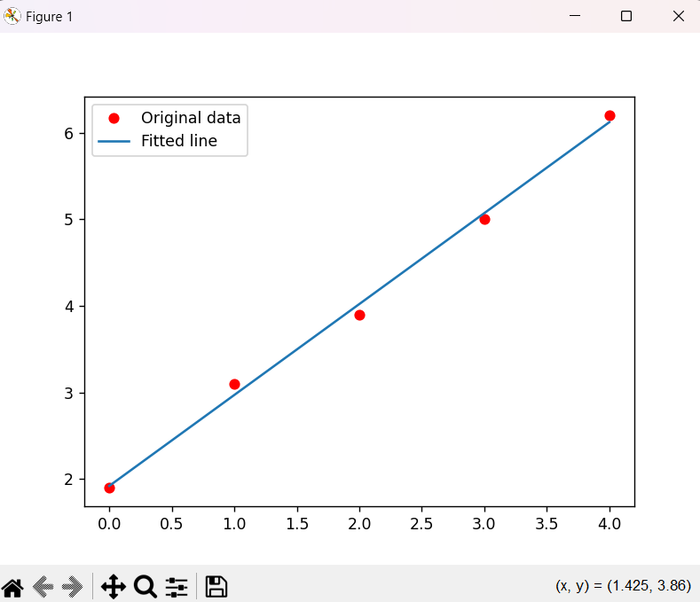

# GRADIENT DESCENT    
How I do it: I watched the WHOLE Karpathy video (especially about gradient descent on 2:05:52)(I also wrote notes at /h5/Notes of Micrograd) and teachers hints and code. 

## 1. Gradient Array   
I watch katarphy's video and saw how he does it. When I watch him, he uses MSE to find the loss. But, since the function created is already a loss function, it does not need to do MSE. So, we just need to do a backpropagation and then change the value of the initial input like +-0,01 and then times the gradient. Finally, we'll know can see the gradient descend by itself. At first this is what the codes look like. 

```
def gradient_descent(f, p, lr=0.01, max_loops=100000,dump_period=1000):
    for loop in range(max_loops):
        loss = f(p)
        for param in p:
            param.grad = 0.0
        loss.backward()
        for param in p:
            param.data -= lr * param.grad
        if loop % dump_period ==0:
            print(f'loop {loop}, p = {[param.data for param in p]}, f(p) = {loss.data}')
    
    return p
```    
Then after launching the code I saw that the result of the loss function has too many zeros e-20 etc. That is why I saw teacher's code and began to implement glen. I understand now that the function of glen is to determine when the optimization process should stop.    

Here is the final result of gd array :    

```
loop 0, p = [0.0, 0.0, 0.0], f(p) = 14.0, glen = 7.483314773547883
loop 670, p = [0.9999986772714915, 1.999997354542983, 2.9999960318144745], f(p) = 2.449454990083901e-11, glen = 9.89839378906275e-06
[0.9999986772714915, 1.999997354542983, 2.9999960318144745]
Most Optimal: 2.449454990083901e-11
```   
>We can see that the loss starts from 14 and it descent to 2.44 e-11 with the each own x,y,z values.

## 2. Gradient Regression   
In gradient regression we need to make a loss function using MSE. I followed teacher codes and put in my gradient descent code and finally got the result. Here is the result:    

   

```
loop 0, p = [0.0, 0.0], f(p) = 91.86999769687658, glen = 109.07795237686145
loop 100, p = [1.8532316083265103, 1.073421064993667], f(p) = 0.05047066774734733, glen = 0.21116596827594175
loop 200, p = [1.9167734590336105, 1.0511317872890493], f(p) = 0.04301736882485478, glen = 0.01020447832472191
loop 300, p = [1.9198440837348691, 1.0500546703034503], f(p) = 0.04299996349339673, glen = 0.0004931257566264935
loop 400, p = [1.9199924699708864, 1.0500026192223861], f(p) = 0.04299992284756108, glen = 2.3830028749724268e-05
loop 429, p = [1.9199968752321739, 1.0500010739401648], f(p) = 0.042999922768833305, glen = 9.897669806078612e-06
y_predicted= [1.9199968752321739, 2.9699979491723387, 4.019999023112503, 5.070000097052668, 6.1200011709928335]
```    
>We can see that the loss decreases and continued to decreases until loop 429 and stopped when the it goes below 0,000001. By loop 429, the parameters converged to p = [1.9199968752321739, 1.0500010739401648] resulting in a small loss value which is 0,043. The predicted y values closely match the actual y values, indicating that this regression model has been trained successfully.