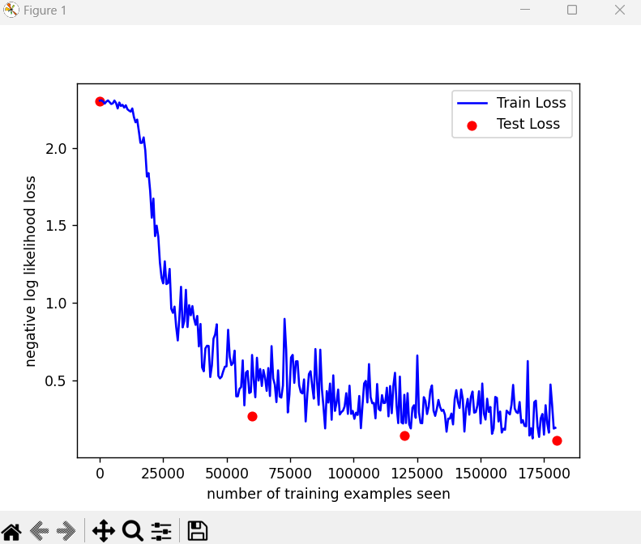

# Training Models

參考 https://cs.stanford.edu/people/karpathy/convnetjs/demo/mnist.html and laoshi's code

## Results



```
Test set: Avg. loss: 0.2683, Accuracy: 9184/10000 (92%)

Train Epoch: 2 [0/60000 (0%)]   Loss: 0.662700
Train Epoch: 2 [640/60000 (1%)] Loss: 0.502664
Train Epoch: 2 [1280/60000 (2%)]        Loss: 0.389007
Train Epoch: 2 [1920/60000 (3%)]        Loss: 0.644707
Train Epoch: 2 [2560/60000 (4%)]        Loss: 0.497077
Train Epoch: 2 [3200/60000 (5%)]        Loss: 0.571744
Train Epoch: 2 [3840/60000 (6%)]        Loss: 0.461994
Train Epoch: 2 [4480/60000 (7%)]        Loss: 0.565116
Train Epoch: 2 [5120/60000 (9%)]        Loss: 0.514755
Train Epoch: 2 [5760/60000 (10%)]       Loss: 0.430473
Train Epoch: 2 [6400/60000 (11%)]       Loss: 0.578032
Train Epoch: 2 [7040/60000 (12%)]       Loss: 0.397268
Train Epoch: 2 [7680/60000 (13%)]       Loss: 0.719851
Train Epoch: 2 [8320/60000 (14%)]       Loss: 0.511090
Train Epoch: 2 [8960/60000 (15%)]       Loss: 0.470619
Train Epoch: 2 [9600/60000 (16%)]       Loss: 0.357863
Train Epoch: 2 [10240/60000 (17%)]      Loss: 0.563135
Train Epoch: 2 [10880/60000 (18%)]      Loss: 0.393699
Train Epoch: 2 [11520/60000 (19%)]      Loss: 0.387008
Train Epoch: 2 [12160/60000 (20%)]      Loss: 0.465420
Train Epoch: 2 [12800/60000 (21%)]      Loss: 0.895919
Train Epoch: 2 [13440/60000 (22%)]      Loss: 0.697684
Train Epoch: 2 [14080/60000 (23%)]      Loss: 0.291012
Train Epoch: 2 [14720/60000 (25%)]      Loss: 0.407226
Train Epoch: 2 [15360/60000 (26%)]      Loss: 0.646516
Train Epoch: 2 [16000/60000 (27%)]      Loss: 0.663183
Train Epoch: 2 [16640/60000 (28%)]      Loss: 0.482037
Train Epoch: 2 [17280/60000 (29%)]      Loss: 0.621311
Train Epoch: 2 [17920/60000 (30%)]      Loss: 0.622061
Train Epoch: 2 [18560/60000 (31%)]      Loss: 0.466296
Train Epoch: 2 [19200/60000 (32%)]      Loss: 0.422160
Train Epoch: 2 [19840/60000 (33%)]      Loss: 0.413897
Train Epoch: 2 [20480/60000 (34%)]      Loss: 0.504743
Train Epoch: 2 [21120/60000 (35%)]      Loss: 0.232835
Train Epoch: 2 [21760/60000 (36%)]      Loss: 0.405463
Train Epoch: 2 [22400/60000 (37%)]      Loss: 0.538678
Train Epoch: 2 [23040/60000 (38%)]      Loss: 0.557711
Train Epoch: 2 [23680/60000 (39%)]      Loss: 0.463727
Train Epoch: 2 [24320/60000 (41%)]      Loss: 0.380359
Train Epoch: 2 [24960/60000 (42%)]      Loss: 0.700997
Train Epoch: 2 [25600/60000 (43%)]      Loss: 0.489774
Train Epoch: 2 [26240/60000 (44%)]      Loss: 0.339832
Train Epoch: 2 [26880/60000 (45%)]      Loss: 0.696732
Train Epoch: 2 [27520/60000 (46%)]      Loss: 0.442933
Train Epoch: 2 [28160/60000 (47%)]      Loss: 0.324066
Train Epoch: 2 [28800/60000 (48%)]      Loss: 0.187784
Train Epoch: 2 [29440/60000 (49%)]      Loss: 0.429265
Train Epoch: 2 [30080/60000 (50%)]      Loss: 0.354939
Train Epoch: 2 [30720/60000 (51%)]      Loss: 0.477955
Train Epoch: 2 [31360/60000 (52%)]      Loss: 0.243665
Train Epoch: 2 [32000/60000 (53%)]      Loss: 0.531033
Train Epoch: 2 [32640/60000 (54%)]      Loss: 0.300985
Train Epoch: 2 [33280/60000 (55%)]      Loss: 0.352725
Train Epoch: 2 [33920/60000 (57%)]      Loss: 0.438994
Train Epoch: 2 [34560/60000 (58%)]      Loss: 0.277611
Train Epoch: 2 [35200/60000 (59%)]      Loss: 0.293237
Train Epoch: 2 [35840/60000 (60%)]      Loss: 0.302744
Train Epoch: 2 [36480/60000 (61%)]      Loss: 0.329923
Train Epoch: 2 [37120/60000 (62%)]      Loss: 0.415700
Train Epoch: 2 [37760/60000 (63%)]      Loss: 0.281663
Train Epoch: 2 [38400/60000 (64%)]      Loss: 0.464118
Train Epoch: 2 [39040/60000 (65%)]      Loss: 0.281778
Train Epoch: 2 [39680/60000 (66%)]      Loss: 0.300911
Train Epoch: 2 [40320/60000 (67%)]      Loss: 0.249726
Train Epoch: 2 [40960/60000 (68%)]      Loss: 0.289628
Train Epoch: 2 [41600/60000 (69%)]      Loss: 0.274581
Train Epoch: 2 [42240/60000 (70%)]      Loss: 0.397688
Train Epoch: 2 [42880/60000 (71%)]      Loss: 0.189128
Train Epoch: 2 [43520/60000 (72%)]      Loss: 0.339250
Train Epoch: 2 [44160/60000 (74%)]      Loss: 0.478177
Train Epoch: 2 [44800/60000 (75%)]      Loss: 0.495327
Train Epoch: 2 [45440/60000 (76%)]      Loss: 0.355545
Train Epoch: 2 [46080/60000 (77%)]      Loss: 0.603711
Train Epoch: 2 [46720/60000 (78%)]      Loss: 0.389788
Train Epoch: 2 [47360/60000 (79%)]      Loss: 0.350392
Train Epoch: 2 [48000/60000 (80%)]      Loss: 0.352863
Train Epoch: 2 [48640/60000 (81%)]      Loss: 0.252839
Train Epoch: 2 [49280/60000 (82%)]      Loss: 0.474939
Train Epoch: 2 [49920/60000 (83%)]      Loss: 0.313132
Train Epoch: 2 [50560/60000 (84%)]      Loss: 0.303452
Train Epoch: 2 [51200/60000 (85%)]      Loss: 0.403158
Train Epoch: 2 [51840/60000 (86%)]      Loss: 0.351456
Train Epoch: 2 [52480/60000 (87%)]      Loss: 0.353690
Train Epoch: 2 [53120/60000 (88%)]      Loss: 0.451051
Train Epoch: 2 [53760/60000 (90%)]      Loss: 0.265690
Train Epoch: 2 [54400/60000 (91%)]      Loss: 0.461880
Train Epoch: 2 [55040/60000 (92%)]      Loss: 0.285956
Train Epoch: 2 [55680/60000 (93%)]      Loss: 0.463455
Train Epoch: 2 [56320/60000 (94%)]      Loss: 0.547406
Train Epoch: 2 [56960/60000 (95%)]      Loss: 0.331565
Train Epoch: 2 [57600/60000 (96%)]      Loss: 0.221897
Train Epoch: 2 [58240/60000 (97%)]      Loss: 0.522977
Train Epoch: 2 [58880/60000 (98%)]      Loss: 0.226286
Train Epoch: 2 [59520/60000 (99%)]      Loss: 0.219527

Test set: Avg. loss: 0.1415, Accuracy: 9580/10000 (96%)

Train Epoch: 3 [0/60000 (0%)]   Loss: 0.405245
Train Epoch: 3 [640/60000 (1%)] Loss: 0.222693
Train Epoch: 3 [1280/60000 (2%)]        Loss: 0.415542
Train Epoch: 3 [1920/60000 (3%)]        Loss: 0.214424
Train Epoch: 3 [2560/60000 (4%)]        Loss: 0.187705
Train Epoch: 3 [3200/60000 (5%)]        Loss: 0.321120
Train Epoch: 3 [3840/60000 (6%)]        Loss: 0.338018
Train Epoch: 3 [4480/60000 (7%)]        Loss: 0.256234
Train Epoch: 3 [5120/60000 (9%)]        Loss: 0.659337
Train Epoch: 3 [5760/60000 (10%)]       Loss: 0.292208
Train Epoch: 3 [6400/60000 (11%)]       Loss: 0.223224
Train Epoch: 3 [7040/60000 (12%)]       Loss: 0.221296
Train Epoch: 3 [7680/60000 (13%)]       Loss: 0.390017
Train Epoch: 3 [8320/60000 (14%)]       Loss: 0.365574
Train Epoch: 3 [8960/60000 (15%)]       Loss: 0.280671
Train Epoch: 3 [9600/60000 (16%)]       Loss: 0.329065
Train Epoch: 3 [10240/60000 (17%)]      Loss: 0.430514
Train Epoch: 3 [10880/60000 (18%)]      Loss: 0.465632
Train Epoch: 3 [11520/60000 (19%)]      Loss: 0.302652
Train Epoch: 3 [12160/60000 (20%)]      Loss: 0.268872
Train Epoch: 3 [12800/60000 (21%)]      Loss: 0.313177
Train Epoch: 3 [13440/60000 (22%)]      Loss: 0.371941
Train Epoch: 3 [14080/60000 (23%)]      Loss: 0.326616
Train Epoch: 3 [14720/60000 (25%)]      Loss: 0.301258
Train Epoch: 3 [15360/60000 (26%)]      Loss: 0.308042
Train Epoch: 3 [16000/60000 (27%)]      Loss: 0.276596
Train Epoch: 3 [16640/60000 (28%)]      Loss: 0.166638
Train Epoch: 3 [17280/60000 (29%)]      Loss: 0.251284
Train Epoch: 3 [17920/60000 (30%)]      Loss: 0.250615
Train Epoch: 3 [18560/60000 (31%)]      Loss: 0.283793
Train Epoch: 3 [19200/60000 (32%)]      Loss: 0.213585
Train Epoch: 3 [19840/60000 (33%)]      Loss: 0.375507
Train Epoch: 3 [20480/60000 (34%)]      Loss: 0.435120
Train Epoch: 3 [21120/60000 (35%)]      Loss: 0.357529
Train Epoch: 3 [21760/60000 (36%)]      Loss: 0.320069
Train Epoch: 3 [22400/60000 (37%)]      Loss: 0.439517
Train Epoch: 3 [23040/60000 (38%)]      Loss: 0.376103
Train Epoch: 3 [23680/60000 (39%)]      Loss: 0.167376
Train Epoch: 3 [24320/60000 (41%)]      Loss: 0.317212
Train Epoch: 3 [24960/60000 (42%)]      Loss: 0.378725
Train Epoch: 3 [25600/60000 (43%)]      Loss: 0.276614
Train Epoch: 3 [26240/60000 (44%)]      Loss: 0.391056
Train Epoch: 3 [26880/60000 (45%)]      Loss: 0.426400
Train Epoch: 3 [27520/60000 (46%)]      Loss: 0.289813
Train Epoch: 3 [28160/60000 (47%)]      Loss: 0.293308
Train Epoch: 3 [28800/60000 (48%)]      Loss: 0.335477
Train Epoch: 3 [29440/60000 (49%)]      Loss: 0.428329
Train Epoch: 3 [30080/60000 (50%)]      Loss: 0.219748
Train Epoch: 3 [30720/60000 (51%)]      Loss: 0.478236
Train Epoch: 3 [31360/60000 (52%)]      Loss: 0.283401
Train Epoch: 3 [32000/60000 (53%)]      Loss: 0.244995
Train Epoch: 3 [32640/60000 (54%)]      Loss: 0.379917
Train Epoch: 3 [33280/60000 (55%)]      Loss: 0.294392
Train Epoch: 3 [33920/60000 (57%)]      Loss: 0.326417
Train Epoch: 3 [34560/60000 (58%)]      Loss: 0.152740
Train Epoch: 3 [35200/60000 (59%)]      Loss: 0.187680
Train Epoch: 3 [35840/60000 (60%)]      Loss: 0.391389
Train Epoch: 3 [36480/60000 (61%)]      Loss: 0.385047
Train Epoch: 3 [37120/60000 (62%)]      Loss: 0.232523
Train Epoch: 3 [37760/60000 (63%)]      Loss: 0.296843
Train Epoch: 3 [38400/60000 (64%)]      Loss: 0.161131
Train Epoch: 3 [39040/60000 (65%)]      Loss: 0.186114
Train Epoch: 3 [39680/60000 (66%)]      Loss: 0.178727
Train Epoch: 3 [40320/60000 (67%)]      Loss: 0.302873
Train Epoch: 3 [40960/60000 (68%)]      Loss: 0.290514
Train Epoch: 3 [41600/60000 (69%)]      Loss: 0.278492
Train Epoch: 3 [42240/60000 (70%)]      Loss: 0.341452
Train Epoch: 3 [42880/60000 (71%)]      Loss: 0.469293
Train Epoch: 3 [43520/60000 (72%)]      Loss: 0.316599
Train Epoch: 3 [44160/60000 (74%)]      Loss: 0.292941
Train Epoch: 3 [44800/60000 (75%)]      Loss: 0.286839
Train Epoch: 3 [45440/60000 (76%)]      Loss: 0.358572
Train Epoch: 3 [46080/60000 (77%)]      Loss: 0.223846
Train Epoch: 3 [46720/60000 (78%)]      Loss: 0.241422
Train Epoch: 3 [47360/60000 (79%)]      Loss: 0.204833
Train Epoch: 3 [48000/60000 (80%)]      Loss: 0.201540
Train Epoch: 3 [48640/60000 (81%)]      Loss: 0.623297
Train Epoch: 3 [49280/60000 (82%)]      Loss: 0.141843
Train Epoch: 3 [49920/60000 (83%)]      Loss: 0.189062
Train Epoch: 3 [50560/60000 (84%)]      Loss: 0.123057
Train Epoch: 3 [51200/60000 (85%)]      Loss: 0.357457
Train Epoch: 3 [51840/60000 (86%)]      Loss: 0.367446
Train Epoch: 3 [52480/60000 (87%)]      Loss: 0.201983
Train Epoch: 3 [53120/60000 (88%)]      Loss: 0.132823
Train Epoch: 3 [53760/60000 (90%)]      Loss: 0.252570
Train Epoch: 3 [54400/60000 (91%)]      Loss: 0.281101
Train Epoch: 3 [55040/60000 (92%)]      Loss: 0.147432
Train Epoch: 3 [55680/60000 (93%)]      Loss: 0.338008
Train Epoch: 3 [56320/60000 (94%)]      Loss: 0.221614
Train Epoch: 3 [56960/60000 (95%)]      Loss: 0.160570
Train Epoch: 3 [57600/60000 (96%)]      Loss: 0.471653
Train Epoch: 3 [58240/60000 (97%)]      Loss: 0.340407
Train Epoch: 3 [58880/60000 (98%)]      Loss: 0.186783
Train Epoch: 3 [59520/60000 (99%)]      Loss: 0.191567

Test set: Avg. loss: 0.1105, Accuracy: 9682/10000 (97%)
```