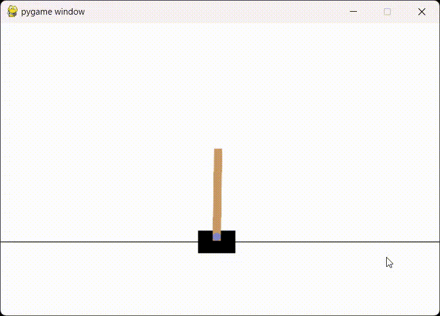

# Cartpole Simulation    
I just used laoshi's code and then modify it according to the instructions   

## Explanation   
There are 4 parameters in cartpole's "observation":   

    

- x: the horizontal position of the cart (positive means to the right)   
- v: the horizontal velocity of the cart (positive means moving to the right)   
- θ: the angle between the pole and the vertical position (positive means clock-wise)   
- ω: angular velocity of the pole (positive means rotating clock-wise)   

What I did in the code is using a Theta-omega policy:
> source: https://towardsdatascience.com/how-to-beat-the-cartpole-game-in-5-lines-5ab4e738c93f    

The policy function determines the action based on the observation:

observation[2] and observation[3] are the angle of the pole (a) and its angular velocity (w), respectively.   
If the pole angle (a) is nearly vertical (less than 0.03 radians), the action depends on the angular velocity (w):  
If w is negative, return 0 (move left).Otherwise, return 1 (move right).   
If the pole is not nearly vertical, the action depends on the angle (a):   
If a is negative, return 0 (move left).Otherwise, return 1 (move right).   


## Results   

    

```
steps: 500
steps: 500
steps: 500
steps: 500
steps: 500
steps: 500
steps: 500
steps: 500
steps: 500
steps: 500
steps: 500
steps: 500
```
