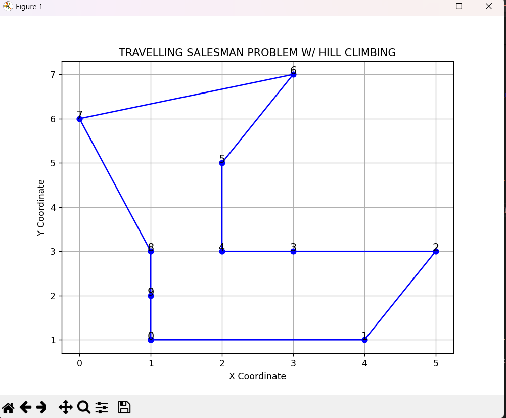

1. Hill climbing Method
2. Nearest Neighbor Method, heuristic method

Notes: I thought I can use any method but then I read the big title: you need to use hill climbing method. since its a waste to delete what i did till finish with the other method, that is why i submitted both methods.

#nearest neighbor method
For the first part of the code is the same as teachers' code. the next part is what i did by myself. I use youtube videos to understand the concept and chatgpt to only help me remember the things that i forgot and all the things i missed. 

To finish this homework, I watch youtube videos about methods to calculate distance from coordinate and also found out about heuristic method.
so heuristic method is a method that got not the most optimal solution but still produce a good result. In this method, I first make a random start point and then try to find the shortest distance possible to go to another coordinate. after I found the shortest distance, I move on to that new coordinate and find again another shortest distance from that new coordinate. This all went on until all the coordinates are visited and i finally got the shortest path, total distance, and the coordinates from this heuristic method.

#hill climb method
with Hill climb you need to do the program MANY times and then you fill the most best solution.(since hill climb method finds the solution from global max(many hills) not neighbor max(some/one hill only)). In the code I did I watch youtube videos and understand all of it.
These are the solution :

```
Optimal Tour Order: [4, 1, 3, 9, 7, 6, 8, 0, 5, 2]
Optimal Tour Distance: 20.79669127533634
From (1, 1) to (4, 1), Distance: 3.0
From (4, 1) to (5, 3), Distance: 2.23606797749979
From (5, 3) to (3, 3), Distance: 2.0
From (3, 3) to (2, 3), Distance: 1.0
From (2, 3) to (2, 5), Distance: 2.0
From (2, 5) to (3, 7), Distance: 2.23606797749979
From (3, 7) to (0, 6), Distance: 3.1622776601683795
From (0, 6) to (1, 3), Distance: 3.1622776601683795
From (1, 3) to (1, 2), Distance: 1.0
From (1, 2) to (1, 1), Distance: 1.0
``` 