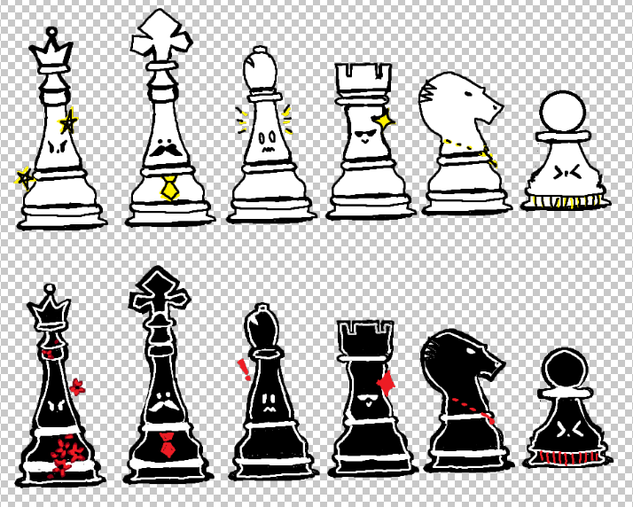
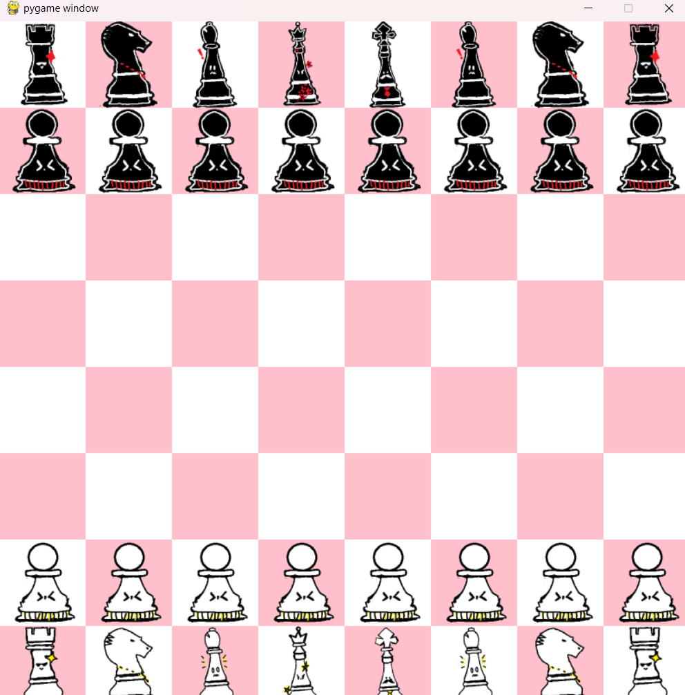
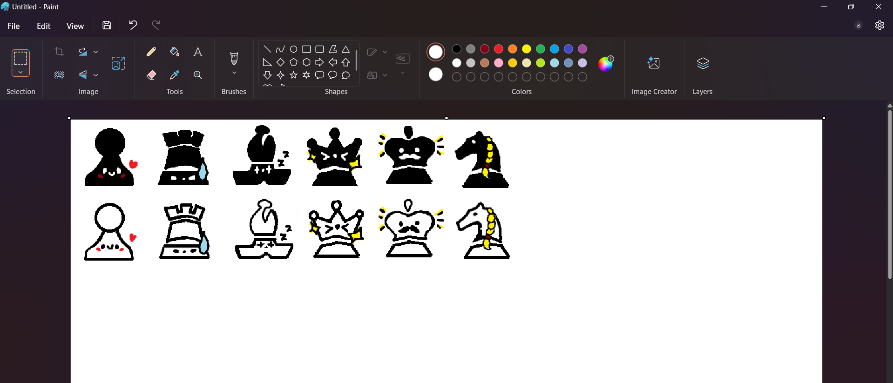
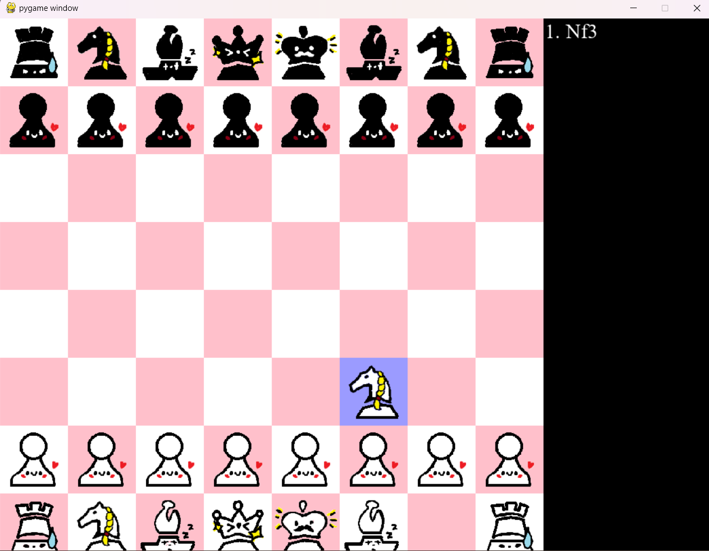
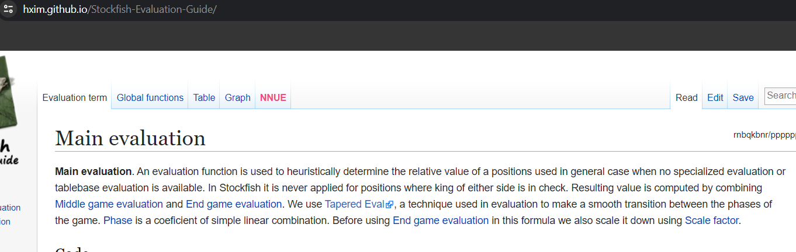

# CHESS Alpha Beta Pruning
I did it by watching videos from this https://youtube.com/playlist?list=PLBwF487qi8MGU81nDGaeNE1EnNEPYWKY_&si=RMUKH819fs5dkWMv , websites, and repositories.
The video teaches me so much about chess.
I didn't know making a chess game will be this long and hard ;-;
## Designs
I got carried away with designing
### First Design
  

     

### Final Design
  

   

## Alpha Beta Pruning
Alpha-Beta pruning is an optimization technique for the Minimax algorithm. It reduces the number of nodes evaluated in the search tree by eliminating branches that cannot influence the final decision.The Chess AI uses a combination of Alpha-Beta pruning and the Negamax algorithm to efficiently search through possible moves and select the best one. Negamax Algorithm is a variant of Minimax optimized for zero-sum games like chess.

In this project,I tried to assign numbers for each pieces. 
```
rookScores = [
    [0.25, 0.3, 0.3, 0.3, 0.3, 0.3, 0.3, 0.25],
    ....]
```

There should be a middle game evaluation and an end game evaluation. So, for example the positional scores for each pieces should be different according to what game evaluation is it in. I tried to find papers that holds any chess positional numbers but i didnt find any. That is why for this project I only did one evaluation of positional numbers for the whole game.
   


